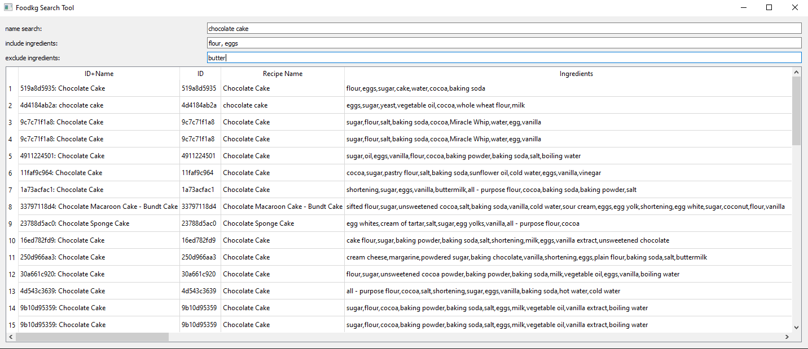

<h1>FoodKG Search Tool </h1>
A tool to search for recipe options in FoodKG dataset that displays recipe ID, name, ingredients, and nutrional information. Search is based on text-matching with recipe name and whether certain ingredients are specified to be included/excluded. The tool will display up to 50 recipes at a time.

<h2>Set Up: </h2>

Notes: The following steps assume you already have python installed. If not, it can be downloaded from [here](https://www.python.org/downloads/).
If you are using Windows, you may have to [download Make](https://www.technewstoday.com/install-and-use-make-in-windows/).

<h3>1. Clone this repository </h3>
<h3>2. Download the raw data </h3>

  The raw data used is from the Recipe1M dataset from the [Im2recipe project](http://im2recipe.csail.mit.edu/). Please follow [this link](http://im2recipe.csail.mit.edu/dataset/register/) to register for download access.

  After registering, download <code>Layers</code>, <code>det_ingrs.json</code> and <code>recipes_with_nutritional_info.json</code> from the [Recipe1M dataset](http://im2recipe.csail.mit.edu/dataset/download/).

  * [layer1.json](http://data.csail.mit.edu/im2recipe/recipe1M_layers.tar.gz) (Inside Layers): The basic descriptions of the recipes (names, url, id, etc.).

  * [det_ingrs.json](http://data.csail.mit.edu/im2recipe/det_ingrs.json): The ingredient information of each recipe in layer1.

  * [recipes_with_nutritional_info.json](http://data.csail.mit.edu/im2recipe/recipes_with_nutritional_info.json): The nutritional information of the recipes.

  After downloading the files, place them under the <code>/resources</code> directory.

<h3>3. In the <code>/src</code> directory, run <code>make setup</code>. </h3>
Note: It is normal for this to take a long time.

<h2>Launching:</h2>
<h3> In the <code>/src</code> directory, run <code>make</code>.</h3>

<h2>Usage:</h2>
The search tool window allows searching by recipe name, and ingredients to include or exclude. For specifying multiple ingredients, enter them as a comma separated list.

In the example below, a search is made for chocolate cake recipes that contain flour and eggs but don't contain butter.

